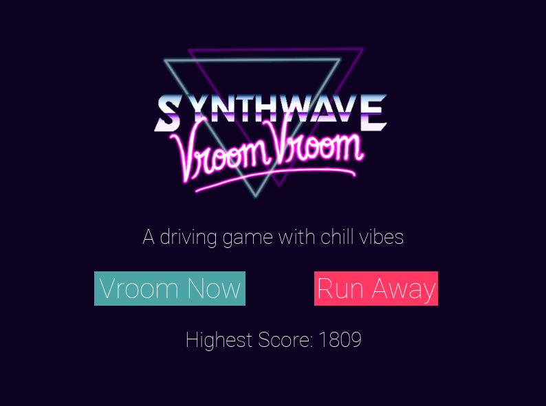

# Synthwave - Vroom! Vroom

## Car Driving game developed in python using the **[Pygame module](https://www.pygame.org/news)**

* level up after every 1k points
* speed increases after every level, making it harder to dodge the obstacles
* vibe to copy right free synthwave music
* complete 10 levels to beat the game!



## Requirements

* python 2+
* pygame 1.9.6+

## How to run

clone the repo

```bash
git clone https://github.com/Aaryamann171/Synthwave-Vroom-Vroom.git
```

install the requirements

```bash
pip install -r requirements.txt
```

run the program

```bash
python main.py
```
